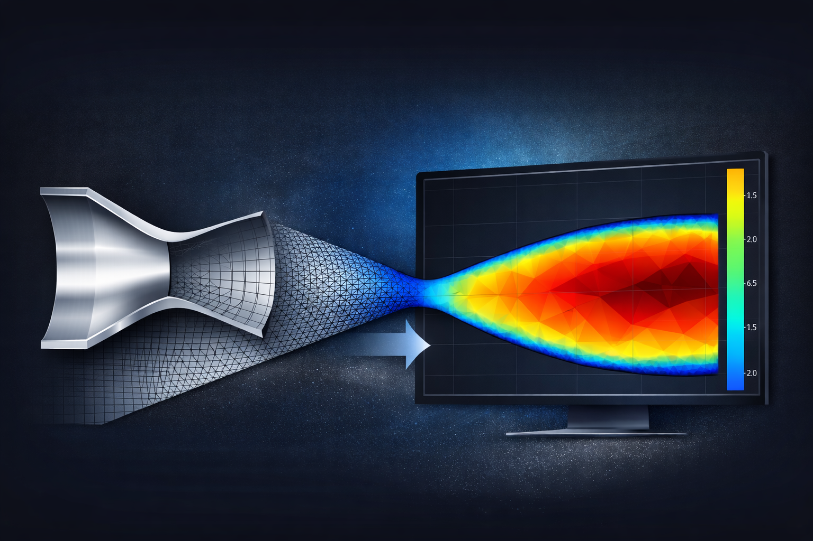
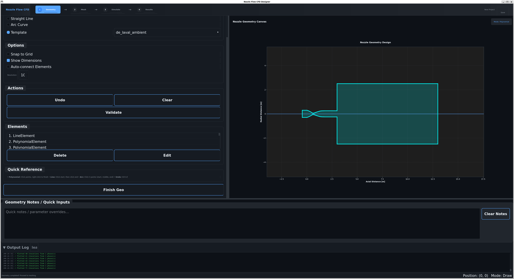
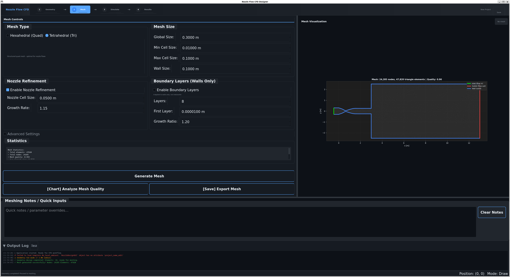
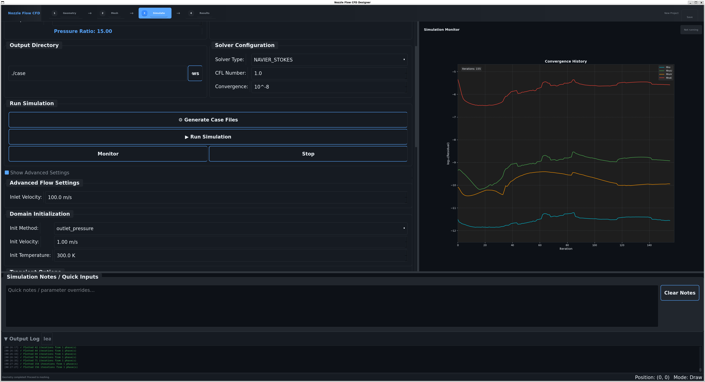
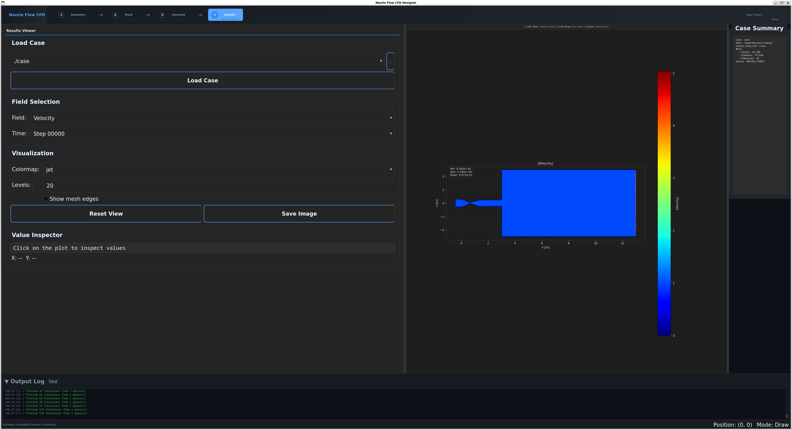

 # Nozzle Flow CFD



A desktop application for nozzle CFD workflow: geometry design, mesh generation, simulation with SU2, and post-processing.

Note: This repository was primarily generated using AI tools (GitHub Copilot with Claude and OpenAI models).


## Quick Start

```bash
python main.py
```


## Features

Geometry Design
- Interactive drawing with polynomial curves, lines, and arcs
- Template-based nozzle geometries (de Laval, conical, bell, converging)
- Real-time visualization with symmetric domain rendering

Mesh Generation
- Gmsh-based meshing with hexahedral and tetrahedral options
- Boundary layer mesh support with configurable layers
- Nozzle refinement zones and quality controls

Simulation
- SU2 solver integration for compressible and incompressible flows
- Solver types: EULER, NAVIER_STOKES, RANS, INC_EULER, INC_NAVIER_STOKES, INC_RANS
- Turbulence models: SA, SST, SA_NEG, SST_SUST
- Real-time convergence monitoring

Post-processing
- Field visualization for velocity, pressure, temperature, and Mach number
- Configurable colormaps and contour levels
- Value inspection and image export


## Screenshots

Geometry Design



Mesh Generation



Simulation Setup and Monitoring



Results Visualization




## Project Structure

```
nozzle_flow_cfd/
    main.py                     Entry point
    configuration.yaml          Application configuration
    standard_values_gui.yml     Default GUI values

    src/
        frontend/               GUI layer
            frontend.py         Main GUI application (PySide6)
            theme.py            UI theming and styling
            theme_showcase.css  CSS theme reference

        backend/                Core functionality
            standard_values.py  Configuration loader

            drawing/            Geometry creation
                geometry.py     Geometry element classes (polynomial, line, arc)
                nozzle.py       Nozzle geometry handling
                template_loader.py  Template loading

            meshing/            Mesh generation
                mesh_generator.py       Gmsh mesh generation with boundary layers
                su2_mesh_converter.py   Gmsh to SU2 mesh conversion

            simulation/         CFD simulation
                simulation_setup.py     SU2 case configuration
                su2_runner.py           SU2 execution wrapper

            postprocessing/     Results analysis
                postprocessing.py               Result visualization
                interactive_postprocessor.py    Interactive plotting widget
                su2_case_analyzer.py            SU2 output parsing

    geometry/
        templates/              Nozzle geometry templates (JSON)

    tests/                      Test suite

    scripts/
        launch_app.sh           Shell launcher
        setup_environment.sh    Environment setup
        plot_su2_results.py     Standalone plotting script
```


## Requirements

Python 3.8 or higher

Core dependencies:
- PySide6
- NumPy
- SciPy
- Matplotlib
- PyYAML

Optional:
- gmsh (Python package for mesh generation)
- SU2 (CFD solver, see https://su2code.github.io/)

Installation:

```bash
conda install pyside6 matplotlib numpy scipy pyyaml
pip install gmsh
```


## Testing

```bash
pytest
```
